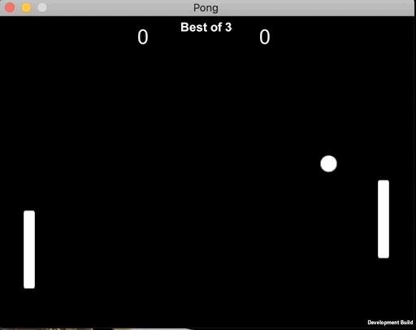

# Pong

 
This is a project for learning Unity. 
Implemented basic Pong game logic: 
* Added directionality when paddle hits ball. 
* Added AI. 
* Added "Play Again" loop. 
* Added basic UI, Music and Sound Effects. 
